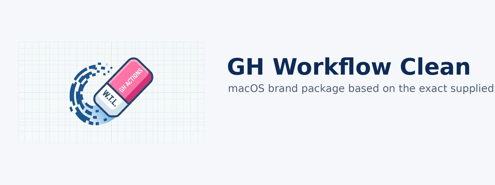

<p align="center">
  
</p>

<p align="center">
  
</p>

<p align="center">
  Professional GitHub Actions cleanup software for macOS.<br>
  Provided by Wayne Tech Lab LLC · <a href="https://www.WayneTechLab.com">www.WayneTechLab.com</a>
</p>

# GH Workflow Clean

Professional GitHub Actions cleanup software for macOS.

Provided by Wayne Tech Lab LLC  
[www.WayneTechLab.com](https://www.WayneTechLab.com)

Repository slug: `GH-Workflow-Clean`  
Current release: `0.2.0`

## Warning

This is a deletion tool. Use at your own risk.

GH Workflow Clean can permanently delete:

- workflow runs
- artifacts
- caches
- workflow configurations

Review the target host, account, repository, and cleanup scope before execution.

## Public Install

Install from any Mac with a single command:

```bash
/bin/bash -c "$(curl -fsSL https://raw.githubusercontent.com/WayneTechLab/GH-Workflow-Clean/main/install.sh)"
```

Then log in and run:

```bash
gh auth login -h github.com
gh-actions-cleanup
```

Or open the native app:

```bash
open "/Applications/GH Workflow Clean.app"
```

## What It Does

- checks GitHub CLI authentication status first
- lets the user choose the GitHub host and authenticated account
- accepts `OWNER/REPO`, `HOST/OWNER/REPO`, or full GitHub repo URLs
- lists repositories for the selected account or owner/org inside the GUI
- supports one repo, many repos, or select-all cleanup from the GUI
- disables workflows
- deletes workflow runs
- deletes artifacts
- deletes caches
- keeps the CLI as the cleanup engine under the native GUI
- stores only the last host, account, and repo for convenience
- does not store GitHub tokens
- redacts common token and key patterns from the native app log panel

## macOS App

The project ships two interfaces:

- `gh-actions-cleanup`
- a native SwiftUI macOS app: `GH Workflow Clean.app`

The native app includes:

- a responsive single-shell SwiftUI layout
- ultrawide, desktop, compact, and narrow breakpoints
- screen-aware launch sizing for large and small displays
- bundled production brand artwork from the supplied press kit
- a repository browser with search, checkmarks, and select-all
- login status visibility for the selected GitHub account
- logout action for the selected account
- a safety arm switch before destructive execution
- a live high-contrast output console
- an every-launch warning and Terms of Service acceptance screen
- bundled help and project info files directly inside the app

## Terms of Service

The app shows a warning and acceptance screen every time it is opened.

Terms file:

- [TERMS-OF-SERVICE.md](TERMS-OF-SERVICE.md)

Core terms:

- this is a deletion tool
- use at your own risk
- use only for the intended professional cleanup purpose
- use only where you are authorized to make these changes
- you accept responsibility for data loss, operational impact, and misuse

## Requirements

- macOS
- GitHub CLI (`gh`)
- a GitHub account authenticated with `gh auth login`
- Xcode or Command Line Tools if you want the native GUI built locally from source

## Local Install From Source

```bash
chmod +x gh-actions-cleanup install-gh-actions-cleanup.sh
./install-gh-actions-cleanup.sh
```

Installer behavior:

- removes older CLI installs before reinstalling
- removes older app bundles before reinstalling
- installs the CLI into a writable macOS bin directory
- installs the app into `/Applications` when writable, otherwise `~/Applications`
- builds the native Finder/Dock icon from the shipped `AppIcon.appiconset`
- bundles the current version and Terms of Service into the app
- bundles help files, security notes, brand docs, and project info into the app
- uses the existing `gh` keychain session instead of storing tokens itself

## Common Commands

Interactive:

```bash
gh-actions-cleanup
```

Full cleanup:

```bash
gh-actions-cleanup --repo OWNER/REPO --all --yes
```

Safe preview first:

```bash
gh-actions-cleanup --repo OWNER/REPO --all --dry-run --yes
```

Custom host or full repo URL:

```bash
gh-actions-cleanup --host github.example.com --repo OWNER/REPO --all --yes
gh-actions-cleanup --repo https://github.example.com/OWNER/REPO --all --yes
gh-actions-cleanup --repo github.example.com/OWNER/REPO --all --yes
```

Delete workflow runs only:

```bash
gh-actions-cleanup --repo OWNER/REPO --delete-runs --yes
```

Delete one exact run:

```bash
gh-actions-cleanup --repo OWNER/REPO --run 21023858697 --yes
gh-actions-cleanup --repo OWNER/REPO --run "https://github.com/OWNER/REPO/actions/runs/21023858697/workflow" --yes
```

Delete one run series:

```bash
gh-actions-cleanup --repo OWNER/REPO --delete-runs --run-filter "Sync Google Analytics Data" --yes
```

Artifacts only:

```bash
gh-actions-cleanup --repo OWNER/REPO --delete-artifacts --yes
```

Caches only:

```bash
gh-actions-cleanup --repo OWNER/REPO --delete-caches --yes
```

## Notes

- users must authenticate first with `gh auth login -h <host>`
- the tool uses the selected active GitHub account on the selected host
- the GUI uses the same `gh` login state as the CLI
- if multiple accounts are authenticated on one host, the CLI can switch and restore the previous account
- the tool does not print, export, or store GitHub tokens
- the token in use needs repository and workflow permissions
- the tool stores only the last host, account, and repo in `~/Library/Application Support/GH Workflow Clean/last-session.env`
- the app can read the legacy last-session path from older versions at `~/Library/Application Support/GitHub Action Clean-Up Tool/last-session.env`
- `--dry-run` is the safest way to validate cleanup scope before deleting anything

## Brand and Packaging Sources

- brand system: [docs/Brand-System.md](docs/Brand-System.md)
- macOS app notes: [docs/macOS-App-Notes.md](docs/macOS-App-Notes.md)
- press kit: [docs/Press-Kit.md](docs/Press-Kit.md)
- help center: [docs/Help-Center.md](docs/Help-Center.md)
- Xcode and bundle metadata: [macos/PROJECT-INFO.md](macos/PROJECT-INFO.md)

## Legal

- Copyright (c) 2026 Wayne Tech Lab LLC
- provided as-is, without warranties or guarantees of any kind
- see [LICENSE](LICENSE)
- see [SECURITY.md](SECURITY.md)
- see [TERMS-OF-SERVICE.md](TERMS-OF-SERVICE.md)

## Creator

Built by Lucas / SatoshiUNO.

- [WayneTechLab.com](https://www.WayneTechLab.com)
- [Networks.CHAT](https://Networks.CHAT)
